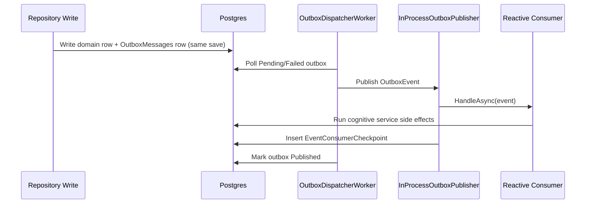

# Event-Driven Architecture (Implemented)

## Goal
Shift cognitive loops from interval polling to reactive execution on memory-domain events.

## What Is Implemented

### Persistence
- Added `OutboxMessages` table (durable event publication queue).
- Added `EventConsumerCheckpoints` table (idempotent consumer processing).
- Added `ConflictEscalationAlerts` table (semantic conflict triage queue).
- Added `UserProfileProjections` table (read-optimized profile projection).
- Added `ProceduralRoutineMetrics` table (routine success/failure tracking).
- EF migration added: `20260222013932_AddEventDrivenOutbox`.
- EF migration added: `20260222015410_AddIntegratedEventingProjections`.

### Event Backbone
- Event contracts and types:
  - `EpisodicMemoryCreated`
  - `SemanticClaimCreated`
  - `SemanticClaimSuperseded`
  - `SemanticEvidenceAdded`
  - `SemanticContradictionAdded`
  - `ProceduralRoutineUpserted`
  - `SelfPreferenceSet`
  - `ToolInvocationCompleted`
- `OutboxWriter` added and registered.
- `OutboxDispatcherWorker` added:
  - polls outbox rows
  - publishes in-process
  - retries failures and dead-letters after max retries
- `InProcessOutboxPublisher` added:
  - resolves consumers
  - enforces idempotency via `EventConsumerCheckpoints`
- `RabbitMqOutboxPublisher` added:
  - publishes `OutboxEvent` envelopes to topic exchange
  - supports topology auto-provisioning
- `RabbitMqInboundConsumerWorker` added:
  - consumes queue messages
  - dispatches to local consumers
  - ack/nack with requeue on failures
- `OutboxEventConsumerDispatcher` added:
  - shared consumer dispatch + idempotency path used by both in-process and RabbitMQ inbound processing

### Reactive Consumers
- `ConsolidationOnEpisodicCreatedConsumer`
- `ReasoningReactiveConsumer`
- `IdentityEvolutionReactiveConsumer`
- `TruthMaintenanceReactiveConsumer`
- `EventingAnalyticsConsumer` (cross-event telemetry counter)
- `SemanticConfidenceRecalcConsumer`
- `MemoryConflictEscalationConsumer`
- `UserProfileProjectionConsumer`
- `RoutineEffectivenessConsumer`
- `EventingSlaConsumer`

### Supporting Workers
- `DeadLetterRecoveryWorker`:
  - periodically replays dead-letter outbox rows by resetting them to `Pending`
  - controlled by `EventDriven:DeadLetterRecovery`

### Write Paths Emitting Events
Outbox events now emitted from all primary write repositories:
- `EpisodicMemoryRepository.AppendAsync`
- `SemanticMemoryRepository`:
  - `CreateClaimAsync`
  - `SupersedeAsync`
  - `AddEvidenceAsync`
  - `AddContradictionAsync`
- `ProceduralMemoryRepository.UpsertAsync`
- `SelfModelRepository.SetPreferenceAsync`
- `ToolInvocationAuditRepository.AddAsync`

### Configuration
Added `EventDriven` config section:
- `Enabled`
- `Transport` (`InProcess` or `RabbitMq`)
- `PollIntervalSeconds`
- `BatchSize`
- `MaxRetries`
- `SlaWarningLagSeconds`
- `SlaErrorLagSeconds`
- `DeadLetterRecovery`:
  - `Enabled`, `IntervalMinutes`, `ReplayBatchSize`
- `RabbitMq`:
  - `Enabled`, `HostName`, `Port`, `UserName`, `Password`, `VirtualHost`
  - `Exchange`, `Queue`, `RoutingKeyPrefix`
  - `PrefetchCount`, `Durable`, `AutoProvisionTopology`

In current appsettings:
- Event-driven enabled by default.
- Development defaults to RabbitMQ transport when enabled.
- Timer workers for consolidation/reasoning/identity/truth are disabled by default.
- Decay worker remains timer-based (time-driven by nature).

## Flow

## Reactivity Matrix
| Event | Consumers |
|---|---|
| `EpisodicMemoryCreated` | Consolidation, Reasoning, IdentityEvolution, RoutineEffectiveness, EventingSLA |
| `SemanticClaimCreated` | Reasoning, IdentityEvolution, TruthMaintenance, UserProfileProjection, EventingSLA |
| `SemanticClaimSuperseded` | TruthMaintenance, EventingSLA |
| `SemanticEvidenceAdded` | TruthMaintenance, SemanticConfidenceRecalc, EventingSLA |
| `SemanticContradictionAdded` | TruthMaintenance, SemanticConfidenceRecalc, MemoryConflictEscalation, EventingSLA |
| `ProceduralRoutineUpserted` | Reasoning, IdentityEvolution, RoutineEffectiveness, EventingSLA |
| `SelfPreferenceSet` | UserProfileProjection, EventingSLA |
| `ToolInvocationCompleted` | EventingSLA |

## Idempotency and Retry
- Consumer idempotency key: `(ConsumerName, EventId)`.
- Dispatcher retries failed outbox rows up to configured `MaxRetries`.
- Rows exceeding retry budget marked `DeadLetter`.

## Operational Notes
- This is an in-process event bus for now (no external broker required).
- RabbitMQ transport is now implemented and selectable by config.
- Outbox pattern keeps further evolution path open to Kafka/Azure Service Bus later.
- External transport can change without changing repository write-path emission.

## Key Files
- `src/CognitiveMemory.Infrastructure/Persistence/Entities/OutboxMessageEntity.cs`
- `src/CognitiveMemory.Infrastructure/Persistence/Entities/EventConsumerCheckpointEntity.cs`
- `src/CognitiveMemory.Infrastructure/Events/*`
- `src/CognitiveMemory.Infrastructure/Background/OutboxDispatcherWorker.cs`
- `src/CognitiveMemory.Infrastructure/Background/RabbitMqInboundConsumerWorker.cs`
- `src/CognitiveMemory.Infrastructure/Reactive/*`
- `src/CognitiveMemory.Infrastructure/Repositories/*` (event emission)
- `src/CognitiveMemory.Infrastructure/DependencyInjection.cs`
- `src/CognitiveMemory.Infrastructure/Persistence/Migrations/20260222013932_AddEventDrivenOutbox.cs`
- `src/CognitiveMemory.Infrastructure/Persistence/Migrations/20260222015410_AddIntegratedEventingProjections.cs`
