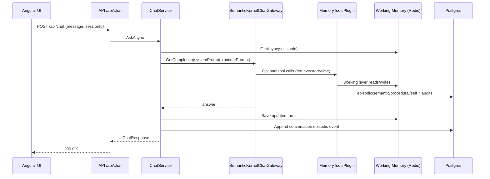
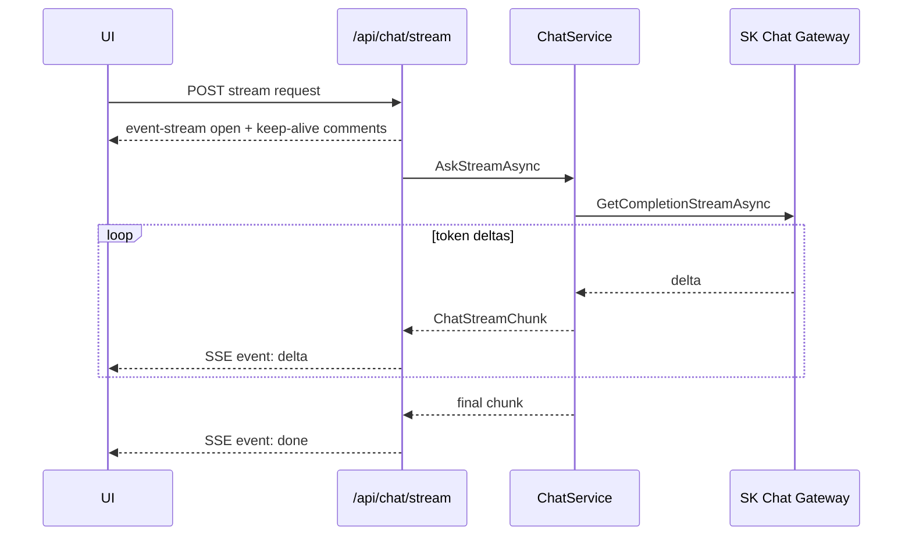
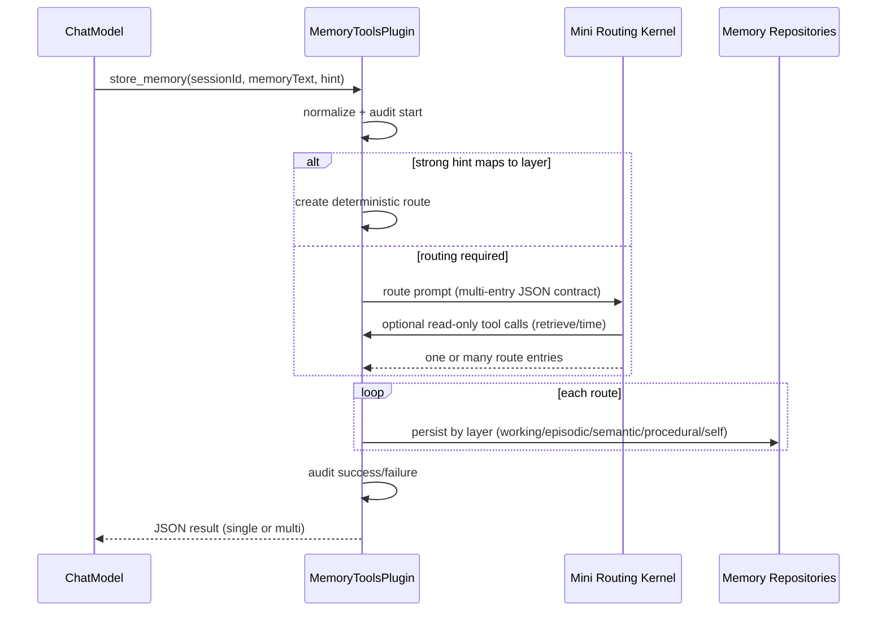
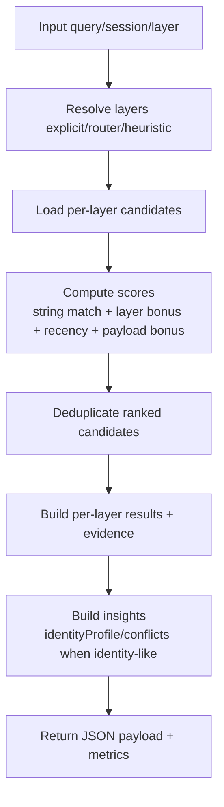

# CognitiveMemory Product Deep Dive

## 1. What This Product Is
CognitiveMemory is a memory-centric conversational system built on .NET + Aspire. It combines:
- a chat runtime with tool-augmented memory access,
- persistent multi-layer memory stores,
- periodic background cognition loops (consolidation, reasoning, identity evolution, truth maintenance, decay),
- and an operator-facing Angular console.

Core objective: make assistant behavior session-aware and durable over time by writing and retrieving structured memory across specialized layers.

## 2. System Composition

### 2.1 Projects and Responsibilities
- `CognitiveMemory.AppHost`
  - Aspire orchestrator for infra + apps.
  - Starts Postgres, Redis, API, frontend, and YARP gateway.
- `CognitiveMemory.ServiceDefaults`
  - Shared OpenTelemetry, health checks, service discovery, and resilience defaults.
- `src/CognitiveMemory.Api`
  - Minimal API transport layer.
  - Middleware, endpoint mapping, and hosted workers.
- `src/CognitiveMemory.Application`
  - Use-case orchestration and business services.
- `src/CognitiveMemory.Domain`
  - Memory domain models and enums.
- `src/CognitiveMemory.Infrastructure`
  - EF Core persistence, Redis working memory store, SK gateways, tool plugin, repository implementations.
- `frontend/cognitive-memory-chat`
  - Angular operations console with streaming chat and memory operations panels.

### 2.2 Runtime Topology
- Client hits gateway at `http://localhost:8080`.
- YARP routes:
  - `/api/**` and `/v1/**` -> API service.
  - all other paths -> Angular frontend.
- API uses:
  - PostgreSQL (`memorydb`) for durable memory.
  - Redis (`cache`) for working memory session context.
- LLM runtime:
  - Main chat kernel can use OpenAI or Ollama.
  - Claim-extraction/routing mini-kernel is independently configurable (currently split-capable: chat one provider, mini model another).

## 3. Memory Model

### 3.1 Memory Layers
- `working`
  - Short-lived conversational turns per session.
  - Stored in Redis with TTL.
- `episodic`
  - Timestamped event history (`who`, `what`, context, source).
  - Stored in Postgres.
- `semantic`
  - Claims/facts with confidence, status lifecycle, evidence, contradictions.
  - Stored in Postgres.
- `procedural`
  - Routines: trigger + steps + checkpoints + outcomes.
  - Stored in Postgres.
- `self`
  - Assistant self-model preferences/identity fields (`identity.*`).
  - Stored in Postgres.

### 3.2 Domain Entities (high level)
- `EpisodicMemoryEvent`
- `SemanticClaim`, `ClaimEvidence`, `ClaimContradiction`, `SemanticClaimStatus`
- `ProceduralRoutine`
- `SelfPreference`, `SelfModelSnapshot`
- `ToolInvocationAudit`

### 3.3 Persistence Tables
`MemoryDbContext` maps:
- `EpisodicMemoryEvents`
- `SemanticClaims`
- `ClaimEvidence`
- `ClaimContradictions`
- `ConsolidationPromotions`
- `ToolInvocationAudits`
- `ProceduralRoutines`
- `SelfPreferences`

## 4. LLM and Tooling Architecture

### 4.1 Chat Gateway
`SemanticKernelChatGateway`:
- wraps system + user prompt into an XML-like envelope.
- optionally registers `MemoryToolsPlugin` for tool use.
- supports normal completion and streaming.
- has timeout + fallback behavior:
  - if streaming fails before first token, fallback to one-shot completion.
  - retries fallback without execution settings if needed.

### 4.2 Model Provider Split
`SemanticKernelFactory` supports separate provider paths:
- Chat kernel: `SemanticKernel.Provider` + `ChatModelId`.
- Mini routing/extraction kernel: `ClaimExtractionProvider` + `ClaimExtractionModelId` (+ optional dedicated Ollama endpoint).

This enables:
- main chat on OpenAI,
- mini routing model on local Ollama.

### 4.3 MemoryToolsPlugin
Exposes SK functions:
- `store_memory(sessionId, memoryText, hint?)`
- `retrieve_memory(sessionId, query, take?, layer?)`
- `get_current_time(utcOffset?)`

Behavioral highlights:
- Tool execution is audited in `ToolInvocationAudits`.
- `retrieve_memory` does cross-layer candidate retrieval + ranking + dedupe + insight generation.
- `store_memory` can route to one or multiple entries/layers.
- Routing mini model can call read-only tools (`retrieve_memory`, `get_current_time`) before deciding routes.
- Strong hint mapping (e.g., identity/self hints) can be honored deterministically.
- Structured self payload parsing supports multi-key writes from one memory blob.

## 5. API Surface

### 5.1 Chat
- `POST /api/chat`
- `POST /api/chat/stream` (SSE)

### 5.2 Episodic
- `POST /api/episodic/events`
- `GET /api/episodic/events/{sessionId}`

### 5.3 Semantic
- `POST /api/semantic/claims`
- `GET /api/semantic/claims`
- `POST /api/semantic/claims/{claimId}/evidence`
- `POST /api/semantic/contradictions`
- `POST /api/semantic/claims/{claimId}/supersede`
- `POST /api/semantic/decay/run-once`

### 5.4 Procedural
- `POST /api/procedural/routines`
- `GET /api/procedural/routines`

### 5.5 Self-model
- `GET /api/self-model/preferences`
- `POST /api/self-model/preferences`

### 5.6 Cognitive Jobs / Ops
- `POST /api/consolidation/run-once`
- `POST /api/reasoning/run-once`
- `POST /api/identity/run-once`
- `POST /api/truth/run-once`
- `GET /api/tool-invocations`

## 6. Core Flows

### 6.1 Chat (non-stream)

### 6.2 Chat Streaming (SSE)

### 6.3 `store_memory` Routing + Persistence

### 6.4 `retrieve_memory` Ranking Flow

### 6.5 Consolidation Loop
- scans recent episodic events (lookback window).
- skips already-processed event ids.
- extracts candidate claim (LLM extractor or regex fallback).
- applies confidence and occurrence thresholds.
- deduplicates against active semantic claims.
- promotes to semantic claim + evidence + marks processed outcome.

### 6.6 Reasoning Loop
- clusters episodic signals into inferred claim candidates.
- creates new semantic claims or strengthens existing ones via supersession.
- can suggest procedural routines from repeated user intent patterns.

### 6.7 Truth Maintenance Loop
- finds conflicting active claims sharing subject+predicate with different values.
- records contradictions.
- adjusts confidence and marks uncertain claims probabilistic (via superseding replacements).

### 6.8 Identity Evolution Loop
- mines episodes/claims/routines for long-term identity signals.
- updates self-model preference keys when inferred values changed.

### 6.9 Decay Loop
- finds stale active semantic claims.
- decays confidence by step.
- retracts if below threshold.

## 7. Background Workers
API hosts periodic workers:
- `ConsolidationWorker`
- `DecayWorker`
- `ReasoningWorker`
- `IdentityEvolutionWorker`
- `TruthMaintenanceWorker`

Each worker:
- can be enabled/disabled by config,
- runs on a fixed timer interval,
- creates a scoped service provider per run,
- logs run summary and continues on failure.

## 8. Middleware, Reliability, and Observability

### 8.1 Middleware
- Exception handler (`UseExceptionHandler`).
- Global fixed-window rate limit (120 req/min).
- `RequestMetricsMiddleware`:
  - duration histogram and error counter.
- `RequestContextLoggingMiddleware`:
  - request/trace scoped logging.

### 8.2 OpenTelemetry / Health
Via `CognitiveMemory.ServiceDefaults`:
- ASP.NET + HttpClient + runtime metrics.
- tracing instrumentation with health endpoint filtering.
- optional OTLP exporter via `OTEL_EXPORTER_OTLP_ENDPOINT`.
- development health endpoints:
  - `/health`
  - `/alive`

### 8.3 Startup DB Lifecycle
- applies EF migrations at API startup.
- falls back to `EnsureCreated()` if no migrations exist.
- warns and skips auto migration on pending model-change mismatch conditions.

## 9. Configuration Model

### 9.1 Key Config Groups
- `SemanticKernel`
  - provider/model ids/timeouts.
  - split provider support for claim/routing kernel.
- `SemanticKernelTooling`
  - enable memory tools.
  - auto tool invocation.
  - plugin name.
- `WorkingMemory`
  - Redis key prefix + TTL.
- Worker option groups:
  - `ConsolidationWorker`, `DecayWorker`, `ReasoningWorker`, `IdentityEvolutionWorker`, `TruthMaintenanceWorker`.
- Algorithm option groups:
  - `Consolidation`, `Reasoning`, `Planning`, `IdentityEvolution`, `TruthMaintenance`.

### 9.2 Current Provider Pattern (dev)
- Chat kernel can remain OpenAI.
- Claim/routing mini kernel can run Ollama locally.

## 10. Frontend Product Behavior
Angular console provides:
- live SSE chat stream,
- memory operations for episodic/semantic/procedural/self,
- one-click background run triggers,
- tool invocation evidence per assistant turn,
- analytics widgets (tool success rate, latency, layer usage, response throughput).

It parses assistant responses for tagged thinking/final blocks when present, but also degrades gracefully to plain markdown text.

## 11. Testing Status

### 11.1 API Tests
- endpoint availability/status tests via `WebApplicationFactory`.
- in-memory stubs for app services and in-memory EF db.
- stream endpoint content-type assertion.

### 11.2 Application Tests
- consolidation promotion and threshold skip scenarios.
- reasoning inference + procedure suggestion.
- truth maintenance conflict handling.
- planning outcome -> procedural upsert.

### 11.3 Tool Plugin Tests
- retrieval ranking behavior for identity scenarios.
- semantic dedupe behavior.
- audit persistence failure resilience.
- self-model update semantics.

## 12. Known Constraints and Practical Notes
- Many retrieval/search paths use text matching heuristics (`ToLower().Contains(...)`), not embeddings/vector search.
- Tool-enabled chat behavior is highly prompt/config dependent.
- DbContext concurrency issues were addressed by serializing plugin query paths.
- SK package version warnings currently flag `Microsoft.SemanticKernel.Core` vulnerability advisory.

## 13. End-to-End Request Walkthrough (Concrete)

Input:
- User says: "My preferred deploy region is eu-west-1."

Likely execution:
1. `/api/chat/stream` receives request.
2. `ChatService` builds runtime prompt with session id.
3. LLM decides memory write is valuable and calls `store_memory`.
4. `MemoryToolsPlugin` routes memory:
   - hint-aware, mini-model assisted, possibly multi-entry.
5. If routed to semantic/self:
   - repositories persist claim or self preference.
6. Tool audit is written.
7. Assistant answer streams back.
8. `ChatService` appends user+assistant turns to Redis working memory.
9. `ChatService` appends episodic conversation event to Postgres.

## 14. File Map for Fast Navigation
- AppHost orchestration: `CognitiveMemory.AppHost/Program.cs`
- API startup: `src/CognitiveMemory.Api/Program.cs`
- Chat transport: `src/CognitiveMemory.Api/Endpoints/ChatEndpoints.cs`
- Chat orchestration + prompt: `src/CognitiveMemory.Application/Chat/ChatService.cs`
- LLM chat gateway: `src/CognitiveMemory.Infrastructure/SemanticKernel/SemanticKernelChatGateway.cs`
- Memory tools plugin: `src/CognitiveMemory.Infrastructure/SemanticKernel/Plugins/MemoryToolsPlugin.cs`
- Provider/model factory: `src/CognitiveMemory.Infrastructure/SemanticKernel/SemanticKernelFactory.cs`
- Persistence model: `src/CognitiveMemory.Infrastructure/Persistence/MemoryDbContext.cs`
- Repositories: `src/CognitiveMemory.Infrastructure/Repositories/*.cs`
- Frontend chat console: `frontend/cognitive-memory-chat/src/app/app.ts`

## 15. Product Summary
CognitiveMemory is implemented as a practical, operator-visible cognitive memory runtime:
- conversational interface,
- tool-grounded retrieval/writes,
- layered memory persistence,
- and autonomous maintenance loops that evolve and clean memory over time.

The architecture is modular and already supports mixed-model operation (main chat vs routing mini model), which is key for cost/performance control and local-first routing strategies.
